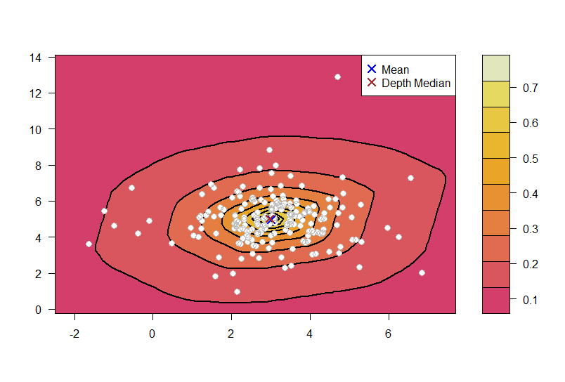
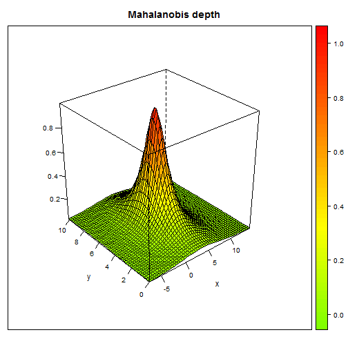

depthproc
========================

depthproc project consist of a set of statistical procedures based on so called statistical depth functions. The project involves free available R package and its description.


## Installation

Currently *depthproc* is not avaiable on CRAN (but soon it will be!). You can install it with *devtools* package:


```r
require(devtools)
install_github("DepthProc", "zzawadz", subdir = "pkg")
```


```r
require(depthproc)
```


## Main features:

### Speed and multithreading

Most of the code is written in C++ for additional efficiency. We also use OpenMP to speedup computations with multithreading:


```r
# Tested on Intel Core i7 3770K
d = 10
x = mvrnorm(1000, rep(0, d), diag(d))
# Default - utilize as many threads as possible
system.time(depth(x, x, method = "LP"))
```

```
##    user  system elapsed 
##    0.83    0.01    0.12
```

```r
# Only single thread - 4 times slower:
system.time(depth(x, x, method = "LP", threads = 1))
```

```
##    user  system elapsed 
##     0.5     0.0     0.5
```

```r
# Two threads - 2 times slower:
system.time(depth(x, x, method = "LP", threads = 2))
```

```
##    user  system elapsed 
##    0.46    0.00    0.23
```


## Available depth functions


```r
x = mvrnorm(100, c(0, 0), diag(2))

depthEuclid(x, x)
depthMah(x, x)
depthLP(x, x)
depthProjection(x, x)
depthLocal(x, x)
depthTukey(x, x)

## Base function to call others:
depth(x, x, method = "Projection")
depth(x, x, method = "Local", depth1 = "LP")

## Get median
depthMedian(x, method = "Local")
```


## Basic plots

### Contour plot

```r
require(mvtnorm)
y = rmvt(n = 200, sigma = diag(2), df = 4, delta = c(3, 5))
depthContour(y, points = TRUE, lwd = 2)
```

 


### Perspective plot

```r
depthPersp(y, method = "Mahalanobis")
```

 


