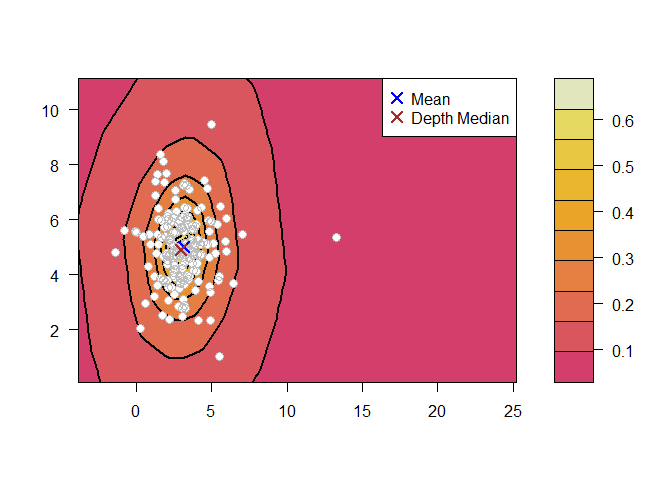
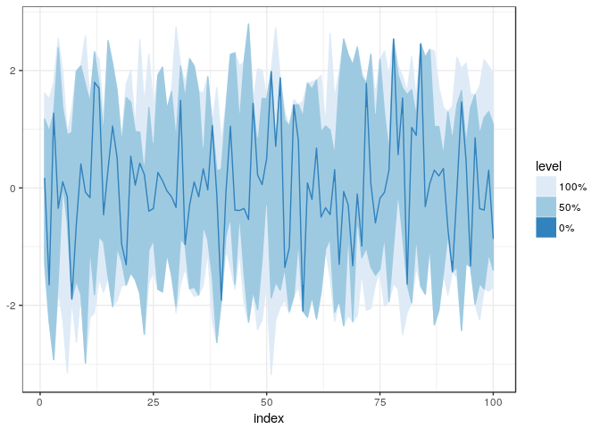

DepthProc
=========

*DepthProc* project consist of a set of statistical procedures based on
so called statistical depth functions. The project involves free
available R package and its description.

### Versions

#### CRAN release version

Installation
------------

*DepthProc* is avaiable on CRAN:

    install.packages("DepthProc")

You can also install it from GitHub with *devtools* package:

    library(devtools)
    install_github("zzawadz/DepthProc")

Main features:
--------------

### Speed and multithreading

Most of the code is written in C++ for additional efficiency. We also
use OpenMP to speedup computations with multithreading:

    library(DepthProc)
    set.seed(123)

    # Tested on Intel Core i7 3770K
    d <- 10
    x <- mvrnorm(1000, rep(0, d), diag(d))
    # Default - utilize as many threads as possible
    system.time(depth(x, x, method = "LP"))

    ##    user  system elapsed 
    ##    0.48    0.00    0.08

    # Only single thread - 4 times slower:
    system.time(depth(x, x, method = "LP", threads = 1))

    ##    user  system elapsed 
    ##    0.25    0.00    0.25

    # Two threads - 2 times slower:
    system.time(depth(x, x, method = "LP", threads = 2))

    ##    user  system elapsed 
    ##    0.25    0.00    0.12

Available depth functions
-------------------------

    x <- mvrnorm(100, c(0, 0), diag(2))

    depthEuclid(x, x)
    depthMah(x, x)
    depthLP(x, x)
    depthProjection(x, x)
    depthLocal(x, x)
    depthTukey(x, x)

    ## Base function to call others:
    depth(x, x, method = "Projection")
    depth(x, x, method = "Local", depth_params1 = list(method = "LP"))

    ## Get median
    depthMedian(x, 
      depth_params = list(
        method = "Local",
        depth_params1 = list(method = "LP")))

Basic plots
-----------

### Contour plot

    library(mvtnorm)
    y <- rmvt(n = 200, sigma = diag(2), df = 4, delta = c(3, 5))
    depthContour(y, points = TRUE, graph_params = list(lwd = 2))

### Perspective plot

    depthPersp(y, depth_params = list(method = "Mahalanobis"))

Functional depths:
------------------

There are two functional depths implemented - modified band depth (MBD),
and Frainman-Muniz depth (FM):

    x <- matrix(rnorm(60), nc = 20)
    fncDepth(x, method = "MBD")
    fncDepth(x, method = "FM", dep1d = "Mahalanobis")

### Functional BoxPlot

    x <- matrix(rnorm(200), ncol = 10)
    fncBoxPlot(x, bands = c(0, 0.5, 1), method = "FM")

