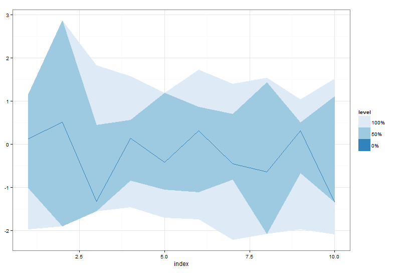

DepthProc
========================

This branch is a development version of *DepthProc*. New functions are preliminary, and may be changed in the future.

Currently, we are developing functionalities related to functional depth, such as functional-box-plot.

## Installation


You can use *devtools* to install development version of *DepthProc*:

```r
require(devtools)
install_github("zzawadz/DepthProc", subdir = "pkg", ref = "Dev")
```


## Functional depths

There are two functional depths implemented  - modified band depth (MBD), and Frainman-Muniz depth (FM):  

```r
x = matrix(rnorm(60), nc = 20)
fncDepth(x, method = "MBD")
fncDepth(x, method = "FM", dep1d = "Mahalanobis")
```

### Functional BoxPlot

```r
x  = matrix(rnorm(200), ncol = 10)
fncBoxPlot(x, bands = c(0, 0.5, 1), method = "FM")
```

 


